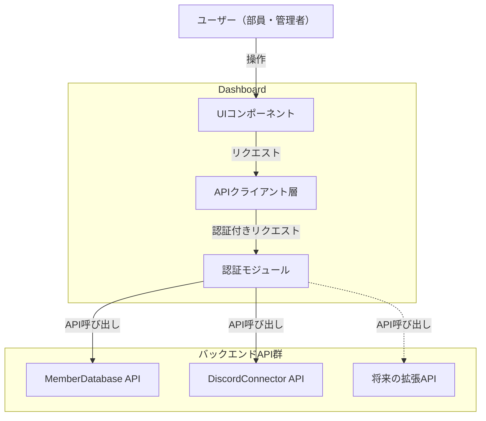

# Dashboard

※フロントエンド全く分からないのでわかる人修正お願いします

# 目的

- 各APIサーバのGUI化
    - 管理の簡易化
    - 操作の簡略化
- 部員の技術レベルに依存しない統一的な操作の提供

# **使用予定の技術**

- **フレームワーク**: Next.js
- **スタイリング**: Tailwind CSS
- **UIコンポーネント**: shadcn/ui
- **認証**: Better Auth
- **ORM**: Drizzle ORM

# **システム概要**

主にこのサブプロジェクトで設計、構築するのは以下の4つ

- 認証モジュール
- APIクライアント層
- UIコンポーネント群
- ルーティング・ページ構成

# **説明**

Dashboardは各バックエンドAPIへの統一的なアクセスポイントとして機能する

# **ユーザー想定**

- **一般部員**: 自身の登録情報の確認・更新
- **管理者**: 部員情報の一括管理、Discord連携設定、各種操作の実行

# **主要画面構成（案）**

| ロール | ログイン後の遷移先 | 利用可能なページ |
| --- | --- | --- |
| 一般部員 | `/dashboard` | マイページのみ |
| 管理者 | `/dashboard` | 全ページ |

| パス | 画面名 | 対象 | 機能 |
| --- | --- | --- | --- |
| `/dashboard` | マイページ / 管理ダッシュボード | 全員（表示内容はロールで分岐） | 一般部員：自分の情報確認・更新
管理者：未更新部員一覧、Discord名不一致、仮登録放置者など |
| `/dashboard/members` | 部員管理 | 管理者のみ | 部員一覧、検索、編集、一括操作 |
| `/dashboard/discord` | Discord管理 | 管理者のみ | ロール・チャンネル権限管理 |
| `/dashboard/settings` | 設定 | 管理者のみ | API接続設定、システム設定 |

# **コンポーネント詳細**

（各コンポーネントの詳細設計は別途ページを作成予定）