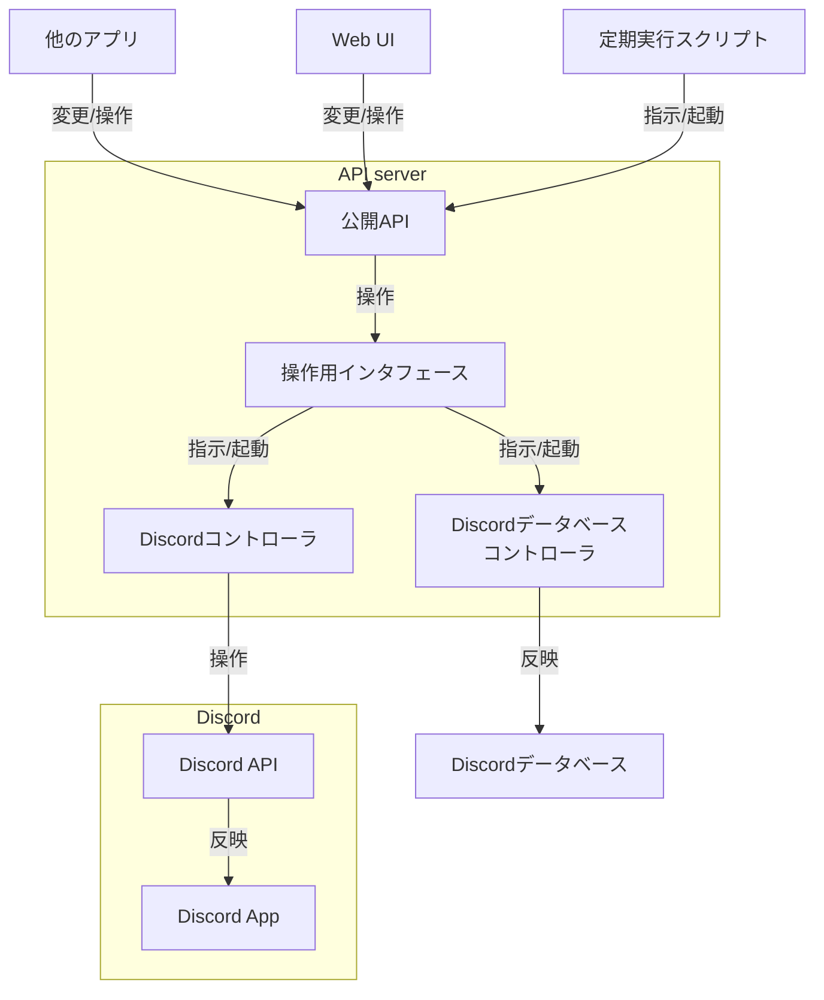

# DiscordConnector

# 目的

- Discordチャンネル権限の管理
- Discordアカウントのロールの管理
- Discordロールの権限の管理
- Discord APIのラップ(安定化)と公開
    - ここでの安定化の意はDiscord側(及びそのエコシステム)の変更を私たちのプログラムで吸収して他のシステムから見えるAPIを変えないことです

追加案を思いつき次第、以下に追記します

- 

(アイデア大募集)

# 課題

- DBのホスティング方法
- システムの拡張性
- 権限周り
    - APIを知っていれば部員情報が手に入るのはまずい
    - APIに対する適切なアクセス権限の設定が必須(アクセストークンで良い?)

# 使用予定の技術

- Discord.py
- fastAPI
- sqlalchemy
- Cloudflare python runner
- MySQL ( or RDBのどれか)

# システム概要

主にこのサブプロジェクトで設計、構築するのは

- Discordコントローラ
- Discordデータベースコントローラ
- 操作用インタフェースシステム
- 外部公開用API
- ~~Web UI~~

の4つです(各コンポーネントの詳しい設計は [コンポーネント詳細](#コンポーネント詳細) を参照してください)

※編集 2025/12/04

Web UIを統合するのをやめて、サブシステムとして分割することにしました

※編集 2026/02/17

各コンポーネントをサーバに分けるのをやめて、モノレポ構成で一つのサービスとして展開するように設計を変更しました

詳細は[全体設計](DiscordConnector/v0.1.md)を参照してください

## 説明

基本的にシステム外からの全ての操作は公開APIを経由して操作システムを起動することで行います。これの狙いとして、外部システムが考える必要がある要素をAPI仕様のみに抑えることがあります。また、内部システムの更新に伴って絶対に変更してはいけない部分をAPIに限定する目的もあります。

### ユーザ想定

### 操作用インタフェースの補足説明

本システムを使用するユーザはDiscordデータベースの内部定義やDiscord APIについての知識は一切必要とせず、公開APIの仕様のみを知ることで制御できることを想定しています。

操作用インタフェースはDiscordコントローラとデータベースコントローラの両者に対して制御が必要となるような操作を抽象化し、隠蔽するために設置しています。例えば、ロールの更新のような場合、Discord上でも、データベース上でも更新が必要となるため、本来であれば2つのサーバに対して制御が必要となります。このような場合に、操作をあたかも1つのサーバに対して行っているかのように隠蔽することが操作用インタフェースを置く目的です。

公開APIと統合していない理由は操作用インタフェースの変更と公開APIの変更は同義では無いためです。

### システムの制御フロー

本システムには2つの制御フローがあります。

- (A) アプリケーションからの呼び出し
    1. 公開APIが呼び出される
    2. 公開APIが操作用インタフェースを起動する
    3. 操作用インタフェースがデータベースコントローラとDiscordコントローラを起動する
    4. 各コントローラが変更を反映する
- (B) 定期実行による整合性担保
    1. 公開APIが呼び出される
    2. 公開APIが操作用インタフェースを起動する
    3. 操作用インタフェースがDiscordコントローラを起動する
    4. DiscordコントローラがDiscordから変更を取得する(チャンネルの増減や表示名の変更等)
    5. Discordコントローラから取得した変更を元にデータベースコントローラを起動する
    6. データベースコントローラが受け取ったDiscord側の変更をデータベースに反映する

# Memo

本システムが公開するAPIの粒度はDiscordAPIの粒度とほぼ同等となる予定です。これにより、ユーザ側からはDiscordを制御しているように見え、内部のデータベース操作を隠蔽できると考えています。また、内部的はデータベースが主権を持つような制御を行いたいと考えています。つまり、種々のデータを管理するのはDiscordデータベースであり、Discordアプリケーション側はあくまでもそのデータに追従しているだけという関係を構築することを目標としています。

# 全体設計

[v0.1](DiscordConnector/v0.1.md)

# コンポーネント詳細

[DiscordController](DiscordConnector/DiscordController.md)

[DiscordDatabaseController](DiscordConnector/DiscordDatabaseController.md)

[ControlInterface](DiscordConnector/ControlInterface.md)

[PublicAPI](DiscordConnector/PublicAPI.md)
