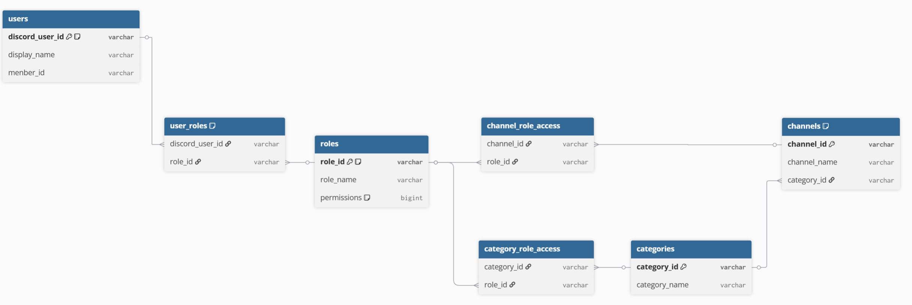

# DiscordDatabaseController

# システム要件

※カテゴリーに関しては知見がほぼ無いので後で修正/追記します

- Discord上の基本的な情報を管理できる
    - ユーザ情報
        - Menber database ID←いるくね？
        - 表示名
        - DiscordのID
        - ロール
    - ロール情報
        - ロールID
        - 権限
    - チャンネル情報
        - チャンネルID
        - アクセスできるロール
        - アクセスできるユーザ(できればロールのみで管理したい)←roleのみにしましょう
    - カテゴリー情報
        - カテゴリーID
        - カテゴリーにアクセスできるロール
        - カテゴリーにアクセスできるユーザ←roleのみにしましょう

database 設計


これ見やすい　https://dbdiagram.io/d

以下貼り付けてください笑

```
// Discord 管理システム ER図

Table users {
  discord_user_id varchar [pk, note: "Discord固有のSnowflake ID"]
  display_name varchar
  menber_id varchar
}

Table roles {
  role_id varchar [pk, note: "DiscordのロールID"]
  role_name varchar
  permissions bigint [note: "権限のビットマスク値"]
}

// ユーザーとロールの中間テーブル
Table user_roles {
  discord_user_id varchar [ref: > users.discord_user_id]
  role_id varchar [ref: > roles.role_id]
  
  Note: "どのDiscordアカウントがどのロールを持っているか"
}

Table categories {
  category_id varchar [pk]
  category_name varchar
}

Table channels {
  channel_id varchar [pk]
  channel_name varchar
  category_id varchar [ref: > categories.category_id]
  
  Note: "1つのカテゴリーに複数のチャンネルが属する(1:N)"
}

// カテゴリーのアクセス権限
Table category_role_access {
  category_id varchar [ref: > categories.category_id]
  role_id varchar [ref: > roles.role_id]
}

// チャンネルのアクセス権限
Table channel_role_access {
  channel_id varchar [ref: > channels.channel_id]
  role_id varchar [ref: > roles.role_id]
}
```

トランザクション

ユーザー参加	users + user_roles (複数行)
ロールの付け替え	user_roles の古い行を DELETE + 新しい行を INSERT
チャンネル新設	channels + channel_role_access (複数行)
カテゴリー削除	category_role_access の削除 + categories の削除 (+ channels の更新)

# API設計

[Beta](DiscordDatabaseController/Beta.md)

# Memo

[MemberDatabase](../MemberDatabase.md) 


