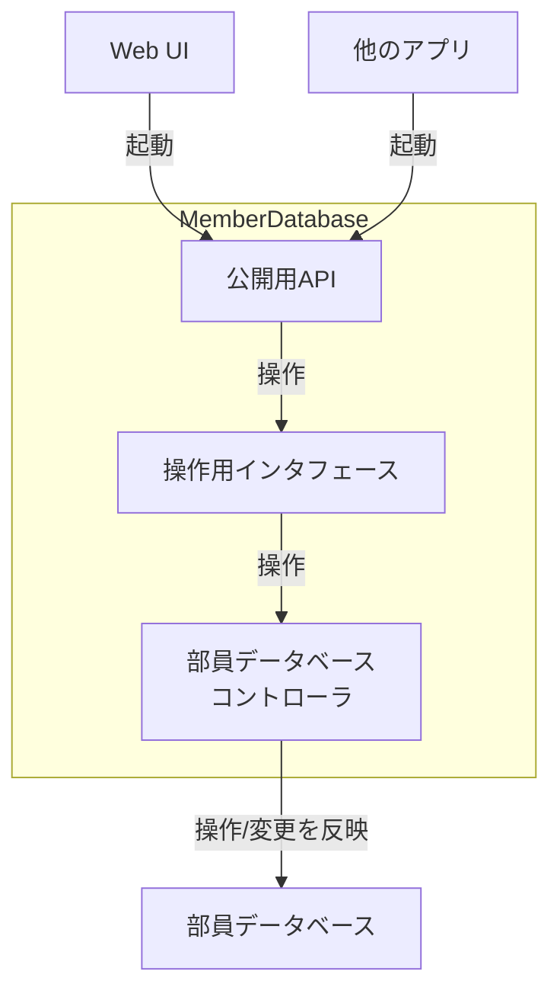

# MemberDatabase

# 目的

- 部員の個人情報の一括管理
    - 学籍番号をキーとする?
        - 院進した場合が厄介
        - 提案：機械的なIDを割り当て、それとは別に学籍番号を保持する
        - → 採用
            - uuidで別カラムで学籍番号を持たせる
- 具体的な管理対象は以下
    - 氏名
    - 性別
    - 学年
    - 緊急連絡先
    - 学内メアド
    - 保険加入状況
    - (アレルギー情報)
- 上記に加え、メタデータとして「作成日」「更新日」を記録
- 入部届のシステムと統合して、入部届が出されたらDBに自動で登録されるようにしたい

# 課題

- DBのホスティング方法
- DBカラム追加時の挙動
- システムの拡張性
- 権限周り
    - APIを知っていれば部員情報が手に入るのはまずい
    - APIに対する適切なアクセス権限の設定が必須

# 使用予定の技術

- fastAPI
- sqlalchemy
- Cloudflare python runner
- MySQL (or RDBのどれか)

# システム概要

主にこのサブプロジェクトで設計、構築するのは

- 部員データベースコントローラ
- 操作用インタフェース
- 公開用API

の3つです。(各コンポーネントの詳細は [コンポーネント詳細](#コンポーネント詳細) を参照してください)

## 説明

DiscordConnector同様に、基本的にシステム外からの全ての操作は公開APIを経由して操作システムを起動することで行います。これの狙いとして、外部システムが考える必要がある要素をAPI仕様のみに抑えることがあります。また、内部システムの更新に伴って絶対に変更してはいけない部分をAPIに限定する目的もあります。

### ユーザ想定

本システムを使用するユーザは部員データベースの内部定義についての知識は一切必要とせず、公開APIの仕様のみを知ることで制御できることを想定しています。

### 操作用インタフェースの補足説明

操作用インタフェースは複数回データベースに対する操作が必要な操作や複数のデータベースAPIを使用しないと実現できない操作を1つのAPIとして隠蔽することが目的です。部員データベースコントローラ側ではアトミックな処理以外をAPIとして提供することは極力避けたいと考えているので、このような設計となっています。

公開APIと統合していない理由は操作用インタフェースの変更と公開APIの変更は同義では無いためです。

### システムの制御フロー

本システムには1つの制御フローがあります。

- アプリケーションからの呼び出し
    1. 公開APIが呼び出される
    2. 公開APIが操作用インタフェースを起動する
    3. 操作用インタフェースが部員データベースコントローラを起動する
    4. コントローラがデータベースに変更を反映する

DiscordConnector側との整合性担保は考慮する必要の無い設計としている、つまり、データベース内でDiscordに関するデータを一切扱わないことを想定しているので、整合性担保のための定期実行スクリプトからの制御フローは想定されません。

# Memo

本システムが公開するAPIの粒度は未定です。外部アプリケーションから使いやすい粒度であるべきという制約こそありますが、具体的な粒度の規定についてはまだ決定していない段階なので、意見や提案をお願いします。

# コンポーネント詳細

[MemberDatabaseController](MemberDatabase/MemberDatabaseController.md)

[ControlInterface](MemberDatabase/ControlInterface.md)

[PublicAPI](MemberDatabase/PublicAPI.md)
